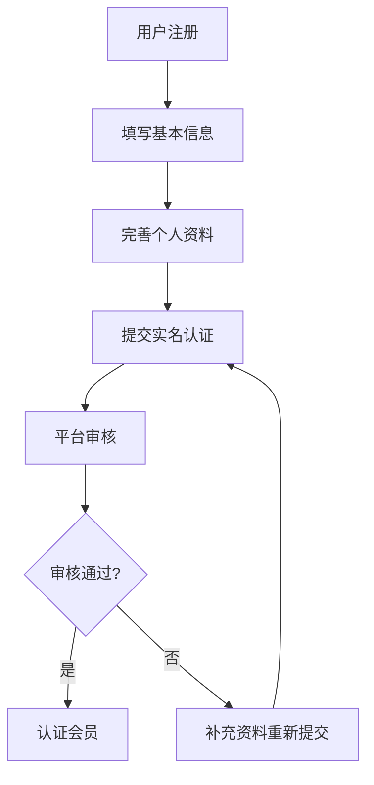
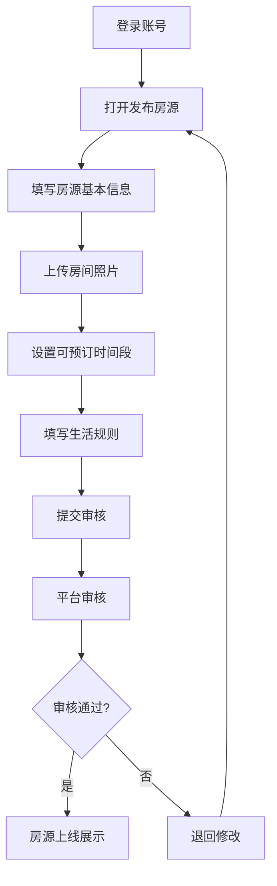
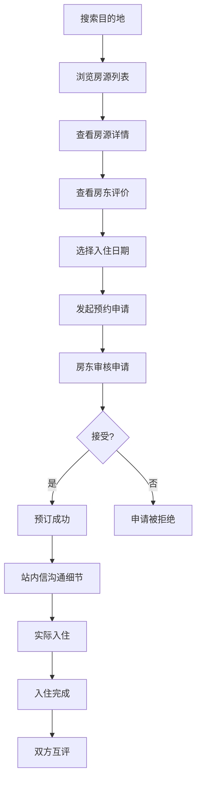
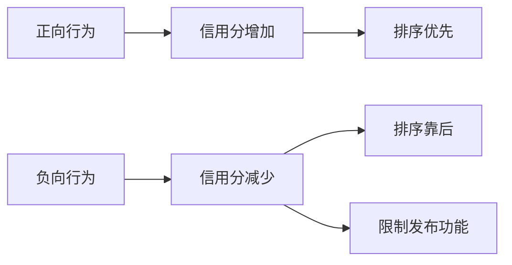

## 1. 产品概述

互助换宿社区平台是一个让全球旅行者免费交换短期住宿的社区平台。会员通过发布自己的空余住宿空间，换取在其他城市的免费住宿机会，实现无金钱交易的互助旅行。

- 主要目的：建立一个基于信任的换宿社区，降低旅行住宿成本，促进文化交流
- 目标用户：热爱旅行、乐于分享、追求独特住宿体验的人群
- 核心价值：免费住宿、真实社交、文化体验、安全保障

## 2. 核心功能

### 2.1 用户角色

| 角色 | 注册方式 | 核心权限 |
|------|----------|----------|
| 普通会员 | 手机号/邮箱注册 | 浏览房源、发布住宿、发起申请、站内信、评价、论坛发帖 |
| 认证会员 | 实名认证通过 | 所有普通会员权限 + 信用分加成、排序优先 |
| 平台管理员 | 后台账号 | 用户管理、房源审核、争议调解、数据统计 |

### 2.2 功能模块

1. **首页**：搜索入口、精选房源、热门目的地、社区动态
2. **用户系统**：注册登录、个人资料、实名认证、信用分
3. **房源管理**：发布房源、房源列表、日历管理、照片上传
4. **搜索预订**：目的地搜索、筛选排序、房源详情、预约申请
5. **站内消息**：消息列表、聊天窗口、申请通知
6. **评价系统**：双方互评、评价展示、信用分计算
7. **社区论坛**：帖子列表、发帖、评论、点赞
8. **个人中心**：我的房源、我的申请、我的评价、积分管理
9. **后台管理**：用户管理、房源审核、争议处理、数据概览

### 2.3 页面详情

| 页面名称 | 模块名称 | 功能描述 |
|----------|----------|----------|
| 首页 | 搜索栏 | 目的地、入住日期、人数搜索 |
| 首页 | 精选房源 | 轮播展示优质认证房源 |
| 首页 | 热门目的地 | 热门城市卡片，点击跳转搜索 |
| 首页 | 社区动态 | 最新论坛帖子预览 |
| 注册登录页 | 注册表单 | 手机号/邮箱、密码、验证码 |
| 注册登录页 | 登录表单 | 账号密码登录、忘记密码 |
| 个人资料页 | 基本信息 | 头像、昵称、简介、联系方式 |
| 个人资料页 | 实名认证 | 身份证上传、人脸识别入口 |
| 个人资料页 | 信用展示 | 信用分、评价数量、认证状态 |
| 房源发布页 | 基本信息 | 房源标题、地址、户型、人数 |
| 房源发布页 | 照片上传 | 多图上传、封面设置 |
| 房源发布页 | 日历管理 | 可预订日期设置、价格（免费） |
| 房源发布页 | 生活规则 | 入住须知、禁止事项、设施说明 |
| 房源详情页 | 房源展示 | 照片轮播、基本信息、设施列表 |
| 房源详情页 | 房东信息 | 房东头像、信用分、认证标识 |
| 房源详情页 | 评价列表 | 历史评价、评分展示 |
| 房源详情页 | 预约按钮 | 选择日期、填写留言、发起申请 |
| 搜索结果页 | 筛选条件 | 价格、人数、设施、评分筛选 |
| 搜索结果页 | 房源列表 | 卡片式展示、排序切换 |
| 消息列表页 | 会话列表 | 所有对话、未读提示 |
| 聊天页面 | 消息气泡 | 文字消息、时间戳、已读状态 |
| 我的申请页 | 发出的申请 | 待审核、已接受、已拒绝、已完成 |
| 我的申请页 | 收到的申请 | 申请详情、接受/拒绝操作 |
| 评价页面 | 评价表单 | 评分、文字评价、标签选择 |
| 论坛首页 | 帖子列表 | 热门/最新帖子、分类筛选 |
| 发帖页面 | 发帖表单 | 标题、内容、图片上传 |
| 帖子详情页 | 帖子内容 | 作者信息、正文、图片 |
| 帖子详情页 | 评论区 | 评论列表、发表评论 |
| 积分中心 | 积分展示 | 当前积分、积分明细 |
| 积分中心 | 兑换商城 | 可兑换的增值服务 |
| 后台首页 | 数据概览 | 用户数、房源数、订单数 |
| 后台用户管理 | 用户列表 | 用户搜索、状态管理 |
| 后台房源管理 | 房源审核 | 待审核房源、审核操作 |
| 后台争议处理 | 争议列表 | 争议详情、调解记录 |

## 3. 核心流程

### 3.1 用户注册与认证流程

用户注册 → 完善个人资料 → 提交实名认证 → 平台审核 → 成为认证会员

### 3.2 房源发布流程

登录 → 进入发布页面 → 填写房源信息 → 上传照片 → 设置可订日期 → 提交审核 → 审核通过上线

### 3.3 预订流程

搜索目的地 → 浏览房源 → 查看详情和评价 → 选择日期 → 发起预约 → 房东确认 → 站内沟通 → 入住 → 双方评价

### 3.4 信用分机制

行为 → 分数变动 → 影响排序/权限

## 4. 用户界面设计

### 4.1 设计风格

- **设计理念**：温暖、信任、社区感
- **主色调**：暖橙色 (#FF6B35) - 代表热情、友好、旅行
- **辅助色**：深青色 (#1A535C) - 代表信任、专业
- **背景色**：米白色 (#F7FFF7) - 温馨舒适
- **强调色**：金色 (#FFD166) - 代表优质、认证
- **按钮风格**：圆角矩形，主按钮橙色渐变，悬停有微弹动效
- **字体**：标题使用圆润现代字体，正文使用清晰易读的无衬线字体
- **布局风格**：卡片式布局，大量留白，柔和阴影
- **图标风格**：线性图标，统一圆角风格
- **整体气质**：像家一样温暖，充满旅行的活力和社区的温度

### 4.2 页面设计概览

| 页面名称 | 模块名称 | UI元素 |
|----------|----------|--------|
| 首页 | Hero区域 | 大背景图、搜索框居中、渐变遮罩、滚动入场动画 |
| 首页 | 精选房源 | 横向滚动卡片、悬浮效果、认证徽章 |
| 首页 | 热门目的地 | 网格布局城市卡片、图片叠加文字、悬停放大 |
| 房源详情页 | 顶部轮播 | 大图轮播、指示点、全屏预览入口 |
| 房源详情页 | 信息卡片 | 白色卡片、分模块展示、图标辅助 |
| 房源详情页 | 房东卡片 | 头像、认证标识、信用分展示、快捷操作 |
| 个人中心 | 个人头部 | 封面图、头像叠加、信用分环形图 |
| 个人中心 | 功能入口 | 网格图标、彩色图标、点击波纹效果 |
| 论坛首页 | 帖子卡片 | 左图右文布局、标签分类、互动数据 |
| 消息列表 | 会话项 | 头像、最新消息预览、未读红点 |

### 4.3 响应式设计

- **设计策略**：桌面端优先，移动端适配
- **断点设置**：1200px（大屏）、992px（平板）、768px（平板竖屏）、576px（手机）
- **移动端优化**：底部导航栏、卡片单列布局、触摸友好的按钮尺寸
- **手势支持**：图片轮播滑动、下拉刷新、左滑操作

### 4.4 动效设计

- **页面加载**：渐入 + 元素错落出现
- **卡片悬浮**：轻微上浮 + 阴影加深
- **按钮交互**：点击缩放反馈
- **图片加载**：模糊占位 → 清晰渐显
- **消息提醒**：徽章弹跳动画
- **滚动效果**：元素随滚动渐入视口
