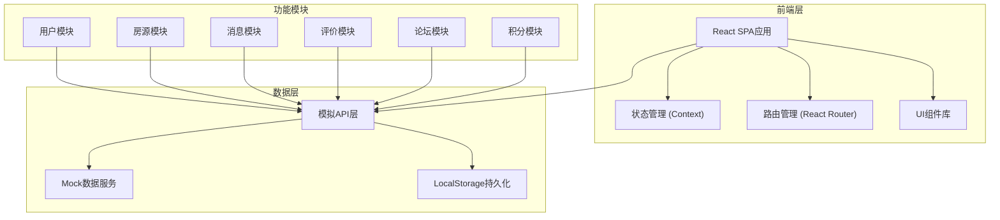
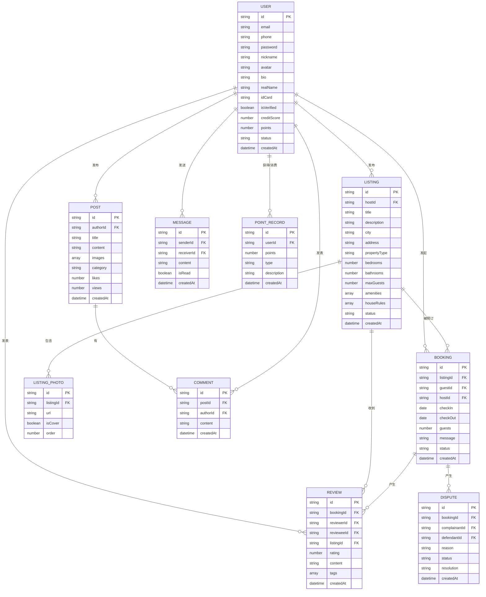

## 1. 架构设计



## 2. 技术描述

- **前端框架**：React@18 + TypeScript
- **构建工具**：Vite
- **样式方案**：TailwindCSS@3 + CSS变量
- **路由管理**：React Router@6
- **状态管理**：React Context + useReducer
- **图标库**：Lucide React
- **数据持久化**：LocalStorage
- **数据方案**：前端Mock数据 + Service模式
- **动画库**：Framer Motion
- **日期处理**：date-fns

## 3. 路由定义

| 路由路径 | 页面名称 | 功能说明 |
|----------|----------|----------|
| / | 首页 | 搜索入口、精选房源、热门目的地 |
| /search | 搜索结果页 | 房源列表、筛选排序 |
| /listing/:id | 房源详情页 | 房源信息、房东信息、评价、预约 |
| /login | 登录页 | 用户登录 |
| /register | 注册页 | 用户注册 |
| /profile | 个人中心 | 个人资料、信用展示 |
| /profile/edit | 编辑资料 | 修改个人信息 |
| /profile/verify | 实名认证 | 提交认证资料 |
| /my-listings | 我的房源 | 房源列表管理 |
| /my-listings/new | 发布房源 | 新建房源 |
| /my-listings/:id/edit | 编辑房源 | 修改房源信息 |
| /my-listings/:id/calendar | 日历管理 | 设置可订日期 |
| /bookings | 我的预订 | 发出/收到的申请 |
| /bookings/:id | 预订详情 | 申请详情、操作 |
| /messages | 消息列表 | 会话列表 |
| /messages/:id | 聊天页面 | 与用户对话 |
| /reviews/:bookingId | 评价页面 | 发表评价 |
| /forum | 论坛首页 | 帖子列表 |
| /forum/new | 发帖页面 | 发布新帖 |
| /forum/:id | 帖子详情 | 帖子内容、评论 |
| /points | 积分中心 | 积分展示、兑换商城 |
| /admin | 后台首页 | 数据概览 |
| /admin/users | 用户管理 | 用户列表管理 |
| /admin/listings | 房源审核 | 待审核房源 |
| /admin/disputes | 争议处理 | 争议列表处理 |

## 4. 数据模型

### 4.1 数据模型定义



### 4.2 核心数据说明

#### 用户表 (USER)
- 信用分初始值 80 分，满分 100 分
- 实名认证通过后 +10 分
- 每次好评 +2 分，差评 -5 分
- 爽约一次 -10 分，低于 60 分限制发布功能
- 积分通过发帖、评价、邀请等行为获得

#### 房源表 (LISTING)
- 状态：pending(审核中)、active(上线)、rejected(拒绝)、offline(下架)
- 设施：wifi、厨房、洗衣机、停车位等
- 生活规则：禁止吸烟、禁止宠物、安静时间等

#### 预订表 (BOOKING)
- 状态：pending(待确认)、accepted(已接受)、rejected(已拒绝)、cancelled(已取消)、completed(已完成)、no_show(爽约)

#### 评价表 (REVIEW)
- 评分 1-5 分
- 标签：干净整洁、房东热情、位置方便、设施齐全等

#### 积分记录表 (POINT_RECORD)
- 类型：earn(获得)、spend(消费)
- 获得途径：实名认证(100)、发布房源(200)、首评(50)、发帖(20)、签到(5)

## 5. 项目目录结构

```
src/
├── assets/              # 静态资源
│   ├── images/
│   └── icons/
├── components/          # 公共组件
│   ├── ui/             # 基础UI组件
│   ├── layout/         # 布局组件
│   └── common/         # 业务通用组件
├── pages/              # 页面组件
│   ├── home/
│   ├── listing/
│   ├── user/
│   ├── booking/
│   ├── message/
│   ├── forum/
│   ├── points/
│   └── admin/
├── services/           # 数据服务层
│   ├── mock/           # mock数据
│   ├── userService.ts
│   ├── listingService.ts
│   ├── bookingService.ts
│   ├── messageService.ts
│   ├── reviewService.ts
│   ├── forumService.ts
│   └── pointsService.ts
├── store/              # 状态管理
│   ├── UserContext.tsx
│   └── AppContext.tsx
├── types/              # TypeScript类型定义
│   └── index.ts
├── utils/              # 工具函数
│   ├── date.ts
│   ├── storage.ts
│   └── format.ts
├── hooks/              # 自定义hooks
│   ├── useAuth.ts
│   └── useModal.ts
├── router/             # 路由配置
│   └── index.tsx
├── App.tsx
├── main.tsx
└── index.css
```

## 6. 核心算法

### 6.1 信用分计算

```
基础分：80分

加分项：
- 实名认证通过：+10分
- 每次收到好评(4-5星)：+2分
- 完成一次接待：+1分
- 无争议完成入住：+1分

减分项：
- 收到差评(1-2星)：-5分
- 拒绝申请（无合理理由）：-1分
- 取消预订(入住前7天内)：-3分
- 爽约：-10分

信用等级：
- 优秀：95-100分
- 良好：85-94分
- 合格：70-84分
- 偏低：60-69分
- 危险：<60分
```

### 6.2 房源排序算法

```
排序权重：
- 信用分权重：30%
- 评价数量权重：20%
- 平均评分权重：25%
- 认证状态加成：15%
- 回复速度权重：10%

综合得分 = 
  (信用分 / 100) * 30 +
  (评价数量 / max评价数量) * 20 +
  (平均评分 / 5) * 25 +
  (已认证 ? 15 : 0) +
  (回复速度分) * 10
```

### 6.3 积分获取规则

| 行为 | 积分 | 每日上限 |
|------|------|----------|
| 每日签到 | 5 | 1次 |
| 完成实名认证 | 100 | 一次性 |
| 发布房源并通过审核 | 200 | 一次性 |
| 发表评价 | 50 | 无 |
| 发布论坛帖子 | 20 | 10次/天 |
| 帖子被点赞 | 2 | 无 |
| 邀请好友注册 | 100 | 无 |
| 好友完成认证 | 200 | 无 |
| 完成首次换宿 | 500 | 一次性 |
